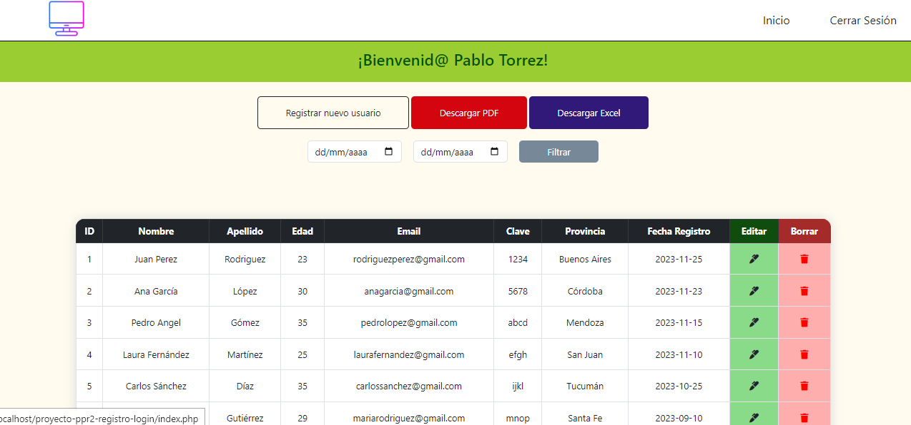

# README - Proyecto CRUD Práctica Profesional 2 - Analista de Sistemas

  

## Introducción

Este proyecto se trata de un CRUD que permite registrar usuarios e iniciar sesión si existen en la base de datos.
Una vez hecho esto, el sistema permite visualizar todos los registros de la base de datos permitiendo modificar o eliminar uno o más registros y filtrar por Fecha de Ingreso los usuarios registrados.

## Tecnologias utilizadas

- [HTML5](https://developer.mozilla.org/en-US/docs/Web/HTML)
- [CSS3](https://developer.mozilla.org/en-US/docs/Web/CSS)
- [JavaScript](https://developer.mozilla.org/en-US/docs/Web/JavaScript)
- [PHP](https://www.php.net/)
- [SQL]
- [Bootstrap](https://getbootstrap.com/)
- [Fontawesome](https://fontawesome.com/)
- [Git](https://git-scm.com/) y [GitHub](https://github.com/)

## Descargas

En este proyecto, el usuario tiene dos botones opcionales para poder descargar un archivo PDF y un archivo XLS (Excel) que le permite visualizar en una tabla los datos de todos los usuarios registrados de la base de datos.

## Instrucciones de uso

Para ejecutar este proyecto en tu entorno local, sigue los siguientes pasos:

1. Clona el repositorio desde GitHub.
2. Configura tu entorno de desarrollo con las tecnologías mencionadas.
3. Abre el proyecto en tu editor de código.
4. Ejecuta la aplicación localmente.

## Acerca del Autor

Desarrollado por [Pablo Torrez](https://github.com/pblnahu1) 

LinkedIn: [Pablo Nahuel Torrez](www.linkedin.com/in/pablo-nahuel-torrez-33a80324b)
Correo Electrónico: [torrezpablo25@gmail.com](mailto:torrezpablo25@gmail.com)
